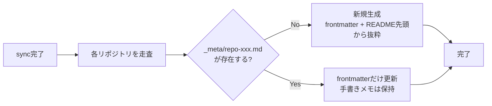

## 人間によるメモ

### やりたいこと

obsidianで構築する。
よくある、obsidianのプレビューでフォルダやファイル間がネットワークとして繋がっているのを構築したい。
下の会話履歴は少し前に構築したモノであり、特にトピックごとにリポジトリを分けているが、現状はモノレポに移行している点に注意。

## 結論(BLUF)

**親ディレクトリをObsidian Vaultにして、`_meta/`フォルダに自動生成したインデックスノートを置くのが一番バランスいい**。
Dataviewプラグインと組み合わせると最強になる。

## アーキテクチャ

```txt
~/repos/my-org/             ← ここをObsidian Vault rootにする
├── .obsidian/              ← Obsidianの設定
├── _meta/                  ← ★ここだけ手を動かす領域
│   ├── _dashboard.md       ← 全リポジトリ一覧(Dataviewで動的生成)
│   ├── repo-a.md           ← 自動生成 + 手書きメモを足す
│   ├── repo-b.md
│   └── ...
├── repo-a/                 ← 既存のgitリポジトリ(触らない)
│   ├── .git/
│   └── src/
├── repo-b/
└── ...
```

ポイントは**gitリポジトリ自体には何も手を加えない**こと。`_meta/`は別途gitで管理してもいいしObsidian専用にしてもいい。

## 各リポジトリのインデックスノートのフォーマット

```markdown
---
tags: [typescript, backend, active, api]
org: my-org
language: TypeScript
status: active # active / archived / wip
topics: [auth, rest]
---

# repo-a

> READMEから自動引用したサマリー

## Links

- [[repo-b]] (依存先)
- [[repo-c]] (関連プロジェクト)

## Files

- [src/main.ts](../repo-a/src/main.ts)

## メモ

ここだけ手書き
```

frontmatterのYAMLがObsidianのタグ・メタデータになって、Dataviewで全部クエリできるようになる。

## Dataview でダッシュボード化

`_meta/_dashboard.md` にこれを書くと一覧が動的生成される：

````markdown
```dataview
TABLE language, status, tags
FROM "_meta"
WHERE status = "active"
SORT language ASC
```
````

```md
| file   | language   | status | tags           |
| ------ | ---------- | ------ | -------------- |
| repo-a | TypeScript | active | [backend, api] |
| repo-b | Python     | active | [ml, scripts]  |

...
```

## 自動生成スクリプトの考え方

さっきのsyncスクリプトの**後処理として追加**するイメージ↓



「新規は全生成、既存はfrontmatterだけ上書きして手書きメモは壊さない」がキモ。
完全に上書きすると手書きメモが消えてつらい。

## オプション比較

| 方式                                   | 向いてる場面                   | 難点                                  |
| -------------------------------------- | ------------------------------ | ------------------------------------- |
| 親フォルダをVault + `_meta/`(おすすめ) | ファイルへの直リンクが使いたい | `.obsidian/`をgitignoreする管理が必要 |
| 別Vaultにインデックスだけ置く          | gitリポジトリと完全分離したい  | ファイルへの相対パスリンクが面倒      |
| Vaultをリポジトリの中に入れる          | 1リポジトリ特化                | 80個には向かない                      |

スクリプト書くとしたら「既存の\_meta/を壊さずにfrontmatterだけ更新する部分」が一番考えどころだけど、書こうか？
あとDataviewプラグインの設定とかも掘り下げれるよ〜

ここでカテゴリを作るpythonスクリプトを渡した。

## 結論(BLUF)

**超ラッキーな構造してる。既存のPythonスクリプトをObsidianのメタ生成にも使いまわすだけでいい。**
カテゴリ・サブカテゴリの情報がスクリプト側にすでに入ってるから、「同じデータソースからREADMEとObsidianのノートを両方出す」構成にするだけ。

---

## 今の構造を整理すると

```txt
.github/
└── scripts/
    └── generate_profile_readme.py  ← カテゴリ情報がここに全部入ってる(はず)
                                       ↓ 今はREADMEだけ出力
                                       ↓ ここからObsidianも出力できる
```

これの何がいいかというと、**カテゴリとリポジトリの関係を二重管理しなくていい**こと。READMEとObsidianが同じソースから生えてくるから矛盾しない。

## 提案するアーキテクチャ

```txt
[data source]
    ↓ (カテゴリ・リポジトリ定義を一元管理)
scripts/generate_profile_readme.py   → README.md (既存)
scripts/generate_obsidian_meta.py    → _meta/*.md (新規追加)
    ↓
GitHub Actions で両方を一緒に実行
```

で、同期先のローカルディレクトリがそのままObsidian Vault:

```txt
~/repos/lvncerpedia/        ← Vault root
├── _meta/
│   ├── _index.md           ← 全体ダッシュボード
│   ├── javascript.md       ← 自動生成
│   ├── react.md
│   ├── nextjs.md
│   └── ...
├── javascript/             ← gitリポジトリ(触らない)
├── react/
└── nextjs/
```

## 生成されるノートのイメージ

```yaml
---
# _meta/react.md (自動生成部分)
tags:
  - category/software-engineering
  - subcategory/implementation
  - lang/javascript
org: lvncerpedia
category: ソフトウェア工学
subcategory: 実装
related:
  - "[[javascript]]"   ← 同じサブカテゴリのリポジトリを自動でリンク
  - "[[nextjs]]"
  - "[[js-libraries]]"
  - "[[tailwindcss]]"
url: https://github.com/lvncerpedia/react
---

# react

> (READMEの先頭N行を自動で引用)

## Notes
<!-- ここだけ手書き。スクリプトは触らない -->
```

サブカテゴリが同じリポジトリは自動的に`related`でつながるのが肝。`javascript`→`react`→`nextjs`→`js-libraries`→`tailwindcss`が全部リンクされる状態が自動でできる。

---

## Obsidian上で見えるグラフのイメージ

```txt
    [ソフトウェア工学]
         |
    [実装ハブノート]
    /    |    \    \    \
[js] [react] [nextjs] [python] [go]
              |
           [react-native]
```

カテゴリノートをハブにしたスター型のグラフが自然に生まれる。

---

## 一番大事な質問だけど

`generate_profile_readme.py`の中身って、カテゴリ定義は**スクリプトにハードコード**してある感じ？それとも別のYAML/JSONとかから読んでる？

そこ次第で「Obsidian生成スクリプトをどこに差し込むか」が変わってくるから教えてほしい〜！

ここでYAMLファイルを渡した。

## 結論(BLUF)

**完璧なデータソースじゃん！そのYAMLを読むだけでObsidianのノートが全自動で生成できる。**

`generate_profile_readme.py`と同じパイプラインに`generate_obsidian_meta.py`を追加するだけ。実際にYAMLを食わせて動作確認してみる。手書きメモがちゃんと残ってる！本番用のスクリプトを出力する。動作確認済み！

## 生成されるもの

```txt
_meta/
├── _index.md                  ← 全体ダッシュボード (Dataview)
├── groups/
│   ├── ソフトウェア工学.md     ← グループハブ (Dataview)
│   ├── 教養・文化.md
│   └── ...
└── repos/
    ├── react.md               ← 各リポジトリノート
    ├── javascript.md
    └── ...
```

## 手書きメモの保護の仕組み

```
react.md
─────────────────────────────
---              ← ここから
tags: [...]
related: [[javascript]], [[nextjs]]
---              ← ここまで 毎回自動上書き

# react          ← ここから下は
## Notes            既存ファイルがあれば
  手書きメモ...    絶対に触らない
─────────────────────────────
```

## GitHub Actionsへの追加

既存のworkflowに1行追加するだけ：

```yaml
- name: Generate README
  run: python scripts/generate_profile_readme.py

- name: Generate Obsidian meta # ← これを追加
  run: python scripts/generate_obsidian_meta.py scripts/repos.yaml _meta/
```

ただし`_meta/`は**gitにコミットしない**ようにした方がいいかも。
手書きメモが入るから、ローカルでだけ実行するかどうかはどうする？

ファイルの使い方をタグと一緒に聞いた。
obsidianにベンダーロックインしたくない意思も伝えた。

## 結論(BLUF)

**ロックインの本質はリポジトリ構成じゃなくてファイル形式の問題。普通のmarkdown+YAMLフロントマターで書けばObsidianはただのビューアになる。**

## ロックインの正体

Obsidianで「ロックインになる書き方」と「ならない書き方」はここだけ：

| 機能                | ロックイン? | 代替                                 |
| ------------------- | ----------- | ------------------------------------ |
| `[[wikilink]]`      | ⚠️ なる     | `[text](./file.md)` (相対パス)       |
| `![[embed]]`        | ⚠️ なる     | 使わない                             |
| Dataviewクエリ      | ⚠️ なる     | `_meta/`の自動生成ファイルだけに限定 |
| YAMLフロントマター  | ✅ ならない | そのままGitHub/VSCodeでも読める      |
| 普通の`# 見出し`    | ✅ ならない | 標準markdown                         |
| `[link](./path.md)` | ✅ ならない | 相対パスはGitHub UIでも動く          |

つまり**ロックインを避けたいなら各リポジトリのファイルはwikilink使わずに書くだけ**。Obsidianはただのいいエディタ・ビューアとして使える。VaultごとVSCodeに移しても、GitHubで読んでも全部そのまま動く。

## 各ファイルの書き方

```markdown
---
tags: [react, hooks, frontend]
created: 2024-06-01
---

# useCallbackのメモ化タイミング

依存配列が変わったときだけ関数が再生成される。
詳細は [公式docs](https://react.dev/reference/react/useCallback)

関連: [useState vs useReducer](./state-management.md) ← 相対パスで書く
```

タグはYAMLに書くだけでObsidianでもGitHubでも機能する。
リポジトリ内のリンクは相対パスにしておけばGitHub UIでもリンクとして機能する。
