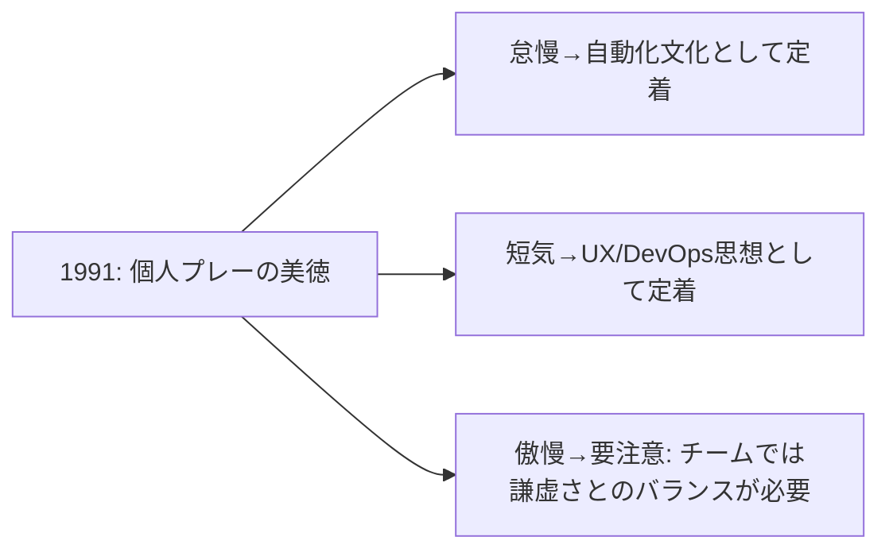

# Three Great Virtues of a Programmer

## 原文

プログラマーの三大美徳（Three Great Virtues of a Programmer）は、プログラミング言語Perlの作者であるラリー・ウォール（Larry Wall）らが著書『Programming Perl』の中で提唱した概念です。

> We will encourage you to develop the three great virtues of a programmer: laziness, impatience, and hubris.

## 結論

結論から言うと、この三大美徳は **文字通り真似するものじゃなくて、逆説的な(皮肉の効いた)ジョーク混じりの表現** なんだよね。
「一見ダメな性格に見えるけど、正しく発揮すると優れたプログラマーになる」っていう逆転の発想が肝。
だから「怠け者になろう！」って字面通り受け取ると変な方向に行っちゃうから注意。

## 三大美徳の正体

| 美徳 | 原語 | 字面の印象 | 本当の狙い | 具体行動の例 |
|---|---|---|---|---|
| 怠慢 | Laziness | サボる | 未来の労力をトータルで減らすために、今めんどくさがって頑張る | 同じ作業3回やったら即スクリプト化・自動化する |
| 短気 | Impatience | イライラしい | コンピュータの反応が遅い・非効率なことへの怒りが、先読みして使いやすいものを作る原動力になる | エラー処理やUXを先回りして設計する |
| 傲慢 | Hubris | 自惚れ | 「これは胸張って公開できる」と思えるレベルまで仕上げる過剰な自尊心 | ドキュメント整備、恥ずかしくないコードを書く |

## なぜこんな逆説的な言い方をしたか

1991年出版の『プログラミングPerl』(通称ラクダ本)の序文で提唱されたやつなんだけど、ラリー・ウォールは言語学者でもあって、こういう**わざと矛盾した言葉で本質を突く言い回し**が得意なんだよね。Perlの設計思想「TMTOWTDI(やり方は一つじゃない)」にも通じる、あの独特のユーモアセンス。

イメージで描くとこんな感じのループ：

```
怠慢(今めんどくさがる)
   │
   ▼
自動化・仕組み化する
   │
   ▼
将来の作業がラクになる ───────┐
   │                      │
   ▼                      │
短気(この非効率さらに許せん)  │
   │                      │
   ▼                      │
さらに先回りして設計する ◄────┘
   │
   ▼
傲慢(これは自慢できる出来だ)
   │
   ▼
公開・共有される良いコード
```

つまり「性格の欠点」を「エンジニアリング的な原動力」に変換してるってことね。
字面のジョークに惑わされず「未来の自分をラクにするための今の努力」って捉えると腑に落ちるはず〜。

**結論**：1991年当時のUnix文化（学術的な"美しさ"より実用性重視）へのアンチテーゼとして、あえて逆説的な言葉選びをしたんだよね。
そして基本の精神は今でも十分通用するけど、チーム開発が当たり前になった今は「傲慢」の使い方だけ少しアップデートが必要かなって感じ！

## なんでこう言ったのか

当時のラリー・ウォールはPerlを「学術的に美しい言語」じゃなく「システム管理者が実務で使い倒すための道具」として作ってた。
だから当時主流だった「勤勉・忍耐・謙虚」みたいな優等生的美徳をあえて裏返して、**現場のエンジニアが実際にやってる行動を肯定する言葉**を選んだの。
皮肉屋な言語学者らしい遊び心プラス、実用主義の宣言でもあったんだよね。

## 今の時代との比較

| 観点 | 1991年当時 | 今(2026年) |
|---|---|---|
| 怠慢 | 個人の作業効率化 | DevOps/CI-CDの思想そのもの。むしろ業界標準の善 |
| 短気 | UIやツールの使いにくさへの怒り | UXデザイン・DX(開発者体験)重視の潮流と完全一致 |
| 傲慢 | 「胸を張れる出来にしろ」という個人の矜持 | チーム開発では要注意ワード。コードレビュー文化・心理的安全性と衝突しがち |



## つまり

- **怠慢・短気**：ほぼそのまま今も通用。むしろ「自動化しろ」「使いにくいものは作るな」って、今のエンジニア文化のド真ん中の価値観になってる
- **傲慢**：ここだけ時代とズレやすい。「自分が満足できるレベルまで仕上げろ」って意味では今も正しいけど、字面通り「傲慢に振る舞う」をやっちゃうとチームで浮くから、実質的には「クオリティへのこだわり」って読み替えるのが安全
