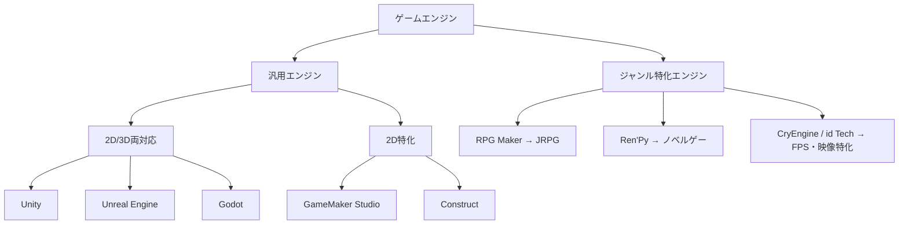

# ゲームエンジンの種類

ゲームエンジンって、要は「ゲームを動かすための土台」のこと。
レンダリング、物理演算、入力処理、アセット管理…みたいな「毎回書くと面倒な部分」を先に用意してくれてる箱。
今の時代、これのおかげでローレベルな部分から全部書く必要がなくなってる。

## 結論(先に言っとく)

| 軸 | 分かれ方 |
|---|---|
| 汎用 vs 特化 | 汎用(Unity/Unreal/Godot) vs ジャンル特化(RPG Maker/Ren'Pyなど) |
| 対応次元 | 2D/3D両対応(Unity/Godot/Unreal) vs 2D専用(GameMaker/Construct) |
| 書き方 | フルコード vs ノーコード・ビジュアルスクリプティング |
| ライセンス | OSS無料(Godot) vs シート課金制(Unity) vs ロイヤリティ制(Unreal) |

個人開発でとりあえず軽く動かしたいなら **Godot**、3Dのビジュアルで殴りたいなら **Unreal Engine**、案件でも個人でも汎用的に使いたいなら **Unity**。この3つが現状の主戦力。

## 歴史的背景

エンジンって概念自体、実は「使い回すために意図的に切り出された」のがそんなに昔じゃない。

- **1993年** `id Software` の DOOM → ゲームロジックとレンダリングを分離した、最初期の「エンジン」という発想が生まれた
- **1996年** `id Tech`(Quakeエンジン)→ 3Dエンジンを他社にライセンス販売するビジネスが始まる。「エンジンを買ってゲームを作る」時代の幕開け
- **1998年** Unreal Engine 初代 → Epic Gamesが本格参入。以後AAA向け高性能エンジンの代表格になっていく
- **2004年** Source Engine(Valve)→ Half-Life 2で物理演算を本格導入し、インタラクティブな環境表現が一気に進化
- **2005年** Unity 登場 → 「個人・中小スタジオでもマルチプラットフォーム展開できる」を実現し、インディーゲーム爆発の起爆剤になった
- **2014年** Godot がOSS公開 → 完全無料・MITライセンスという選択肢が育ち始める
- **2023年** Unityが「Runtime Fee」騒動 → インストール数に応じた課金を発表して大炎上。2024年9月に完全撤回し、現在はシート課金モデルに回帰済み(2026年1月にも約5%の値上げあり)

## 主要エンジン比較表

| エンジン | 主言語 | 得意分野 | ライセンス | 代表作 |
|---|---|---|---|---|
| Unity | C# | 2D/3D・モバイル・マルチプラットフォーム | 年商20万ドル未満は無料/以降シート課金 | ポケモンGO, Cuphead |
| Unreal Engine | C++ / Blueprint | ハイエンド3D・AAA・映像 | 無料、収益100万ドル超で5%ロイヤリティ | フォートナイト, FF7リメイク |
| Godot | GDScript / C# / C++ | 2D/3D・軽量・OSS | 完全無料(MIT) | Brotato, Dome Keeper |
| GameMaker Studio | GML | 2D特化・レトロ/ドット絵 | 無料枠+サブスク | Undertale, Hyper Light Drifter |
| Construct | ビジュアルスクリプティング | 2D・ブラウザ/学習用途 | サブスク | - |
| RPG Maker | イベントコマンド中心 | JRPG特化 | 買い切り | 洞窟物語系, 個人制作JRPG多数 |
| Ren'Py | Python寄りDSL | ノベルゲー特化 | 完全無料(OSS) | Doki Doki Literature Club |
| CryEngine | C++ | グラフィック特化3D | ロイヤリティ制 | Crysis |
| id Tech | C++ | FPS特化・基本は自社利用 | 非公開 | DOOM Eternal |

## 分類図



## 選び方フローチャート

```text
何を作りたい？
├─ 2D中心の個人開発        → Godot(無料・軽量) or GameMaker(ドット絵に強い)
├─ 3Dでビジュアル勝負      → Unreal Engine
├─ モバイル/クロスプラットフォーム重視 → Unity
├─ ノベルゲー・ADV         → Ren'Py or ティラノスクリプト
├─ JRPG作りたいだけ        → RPG Maker
└─ プログラム書きたくない  → Construct / GDevelop
```

## まとめ

「エンジン」と名の付くものは、全部「車輪の再発明をしなくていい箱」だと思えばOK。
中身は「レンダリング + 物理 + 入力 + アセット管理」のセットで、そこに何を足すか・誰向けに最適化するかがエンジンごとの個性になってる。

関連: [`godot`](https://github.com/lvncerpedia/wiki/tree/main/godot) — Godotの個別実装ノウハウはこっち
