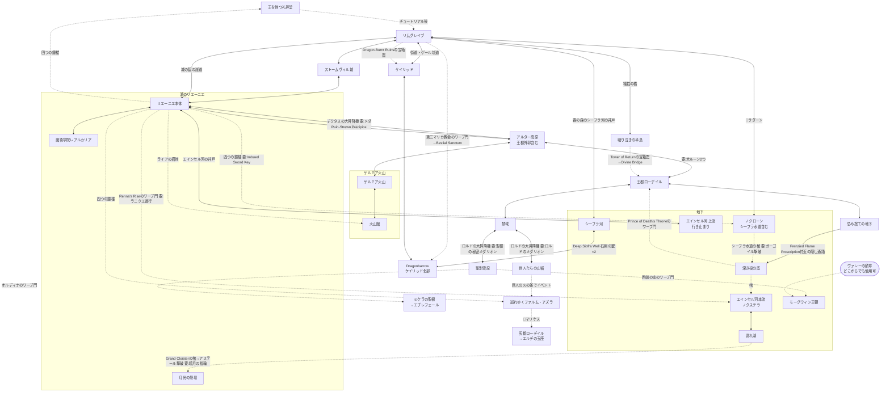
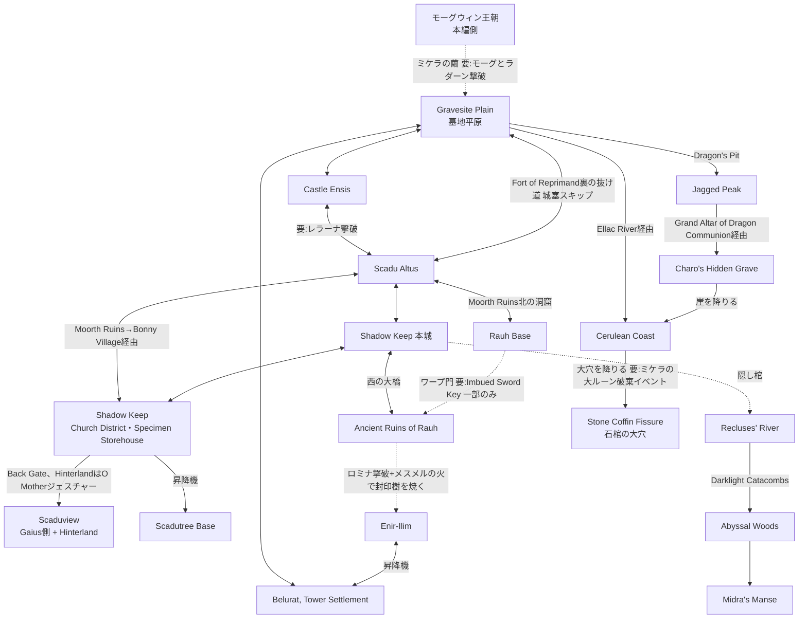

## 本編（狭間の地）

```mermaid
flowchart TB
  CHAPEL["王を待つ礼拝堂"]
  LIM["リムグレイブ"]
  WEEP["啜り泣きの半島"]
  STORM["ストームヴィル城"]
  subgraph LIUG["湖のリエーニエ"]
    LIU["リエーニエ本体"]
    ACAD["魔術学院レアルカリア"]
    MOON["月光の祭壇"]
  end
  CAE["ケイリッド"]
  DRAG["Dragonbarrow<br/>ケイリッド北部"]
  ALT["アルター高原<br/>王都外郭含む"]
  subgraph GELG["ゲルミア火山"]
    GEL["ゲルミア火山"]
    VOL["火山館"]
  end
  LEY["王都ローデイル"]
  SHUN["忌み捨ての地下"]
  FORB["禁域"]
  MTN["巨人たちの山嶺"]
  SNOW["聖別雪原"]
  HALI["ミケラの聖樹<br/>→エブレフェール"]
  FARUM["崩れゆくファルム・アズラ"]
  ASH["灰都ローデイル<br/>→エルデの玉座"]
  subgraph UG["地下"]
    SIO["シーフラ河"]
    NOK["ノクローン<br/>シーフラ水道含む"]
    AIN["エインセル河 上流<br/>行き止まり"]
    AINM["エインセル河本流<br/>ノクステラ"]
    ROT["腐れ湖"]
    DEEP["深き根の底"]
    MOHG["モーグウィン王朝"]
  end
  VARRE(["ヴァレーの勲章<br/>どこからでも使用可"])

  CHAPEL -.->|"チュートリアル後"| LIM
  LIM <-->|"犠牲の橋"| WEEP
  LIM <--> STORM
  STORM <--> LIU
  LIM <-->|"城の脇の崖道"| LIU
  LIM <-->|"街道・ゲール坑道"| CAE
  LIM -.->|"Dragon-Burnt Ruinsの宝箱罠"| CAE
  LIM -.->|"第三マリカ教会のワープ門→Bestial Sanctum"| DRAG
  CAE <--> DRAG
  LIM <-->|"霧の森のシーフラ河の井戸"| SIO
  SIO <-->|"Deep Siofra Well 石剣の鍵×2"| DRAG
  LIM <-->|"👿ラダーン"| NOK
  LIU <--> ACAD
  LIU <-->|"デクタスの大昇降機 要:メダリオン左右"| ALT
  LIU <-->|"Ruin-Strewn Precipice"| ALT
  LIU -.->|"ライアの招待"| VOL
  LIU <-->|"エインセル河の井戸"| AIN
  LIU -.->|"Renna's Riseのワープ門 要:ラニクエ進行"| AINM
  LIU -.->|"四つの鐘楼"| CHAPEL
  LIU -.->|"四つの鐘楼 要:Imbued Sword Key"| NOK
  LIU -.->|"四つの鐘楼"| FARUM
  AINM <--> ROT
  ROT -.->|"Grand Cloisterの棺→アステール撃破 要:暗月の指輪"| MOON
  ALT <--> GEL
  GEL <--> VOL
  ALT <-->|"要:大ルーン2つ"| LEY
  LEY <--> SHUN
  SHUN -->|"Frenzied Flame Proscription付近の隠し通路"| DEEP
  NOK -.->|"シーフラ水道の棺 要:ガーゴイル撃破"| DEEP
  DEEP -.->|"棺"| AINM
  DEEP -.->|"Prince of Death's Throneのワープ門"| LEY
  WEEP -.->|"Tower of Returnの宝箱罠→Divine Bridge"| LEY
  LEY <--> FORB
  FORB <-->|"ロルドの大昇降機 要:ロルドのメダリオン"| MTN
  FORB <-->|"ロルドの大昇降機 要:聖樹の秘密メダリオン"| SNOW
  SNOW -.->|"オルディナのワープ門"| HALI
  SNOW -.->|"西端の血のワープ門"| MOHG
  VARRE -.-> MOHG
  MTN -.->|"巨人の火の釜でイベント"| FARUM
  FARUM -.->|"👿マリケス"| ASH
```

## DLC（影の地）

```mermaid
flowchart TB
  MOHG["モーグウィン王朝<br/>本編側"]
  GP["Gravesite Plain<br/>墓地平原"]
  BEL["Belurat, Tower Settlement"]
  ENSIS["Castle Ensis"]
  SA["Scadu Altus"]
  SK["Shadow Keep 本城"]
  CD["Shadow Keep<br/>Church District・Specimen Storehouse"]
  SV["Scaduview<br/>Gaius側 + Hinterland"]
  STB["Scadutree Base"]
  RBASE["Rauh Base"]
  RAUH["Ancient Ruins of Rauh"]
  RR["Recluses' River"]
  AW["Abyssal Woods"]
  MM["Midra's Manse"]
  JAG["Jagged Peak"]
  CHARO["Charo's Hidden Grave"]
  CC["Cerulean Coast"]
  SCF["Stone Coffin Fissure<br/>石棺の大穴"]
  EI["Enir-Ilim"]

  MOHG -.->|"ミケラの繭 要:モーグとラダーン撃破"| GP
  GP <--> BEL
  GP <--> ENSIS
  ENSIS <-->|"要:レラーナ撃破"| SA
  GP <-->|"Fort of Reprimand裏の抜け道 城塞スキップ"| SA
  GP -->|"Ellac River経由"| CC
  GP -->|"Dragon's Pit"| JAG
  JAG -->|"Grand Altar of Dragon Communion経由"| CHARO
  CHARO -->|"崖を降りる"| CC
  CC -->|"大穴を降りる 要:ミケラの大ルーン破棄イベント"| SCF
  SA <--> SK
  SA <-->|"Moorth Ruins→Bonny Village経由"| CD
  SK <--> CD
  CD -->|"昇降機"| STB
  CD -->|"Back Gate、HinterlandはO Motherジェスチャー"| SV
  SK <-->|"西の大橋"| RAUH
  SA <-->|"Moorth Ruins北の洞窟"| RBASE
  RBASE -.->|"ワープ門 要:Imbued Sword Key 一部のみ"| RAUH
  SK -.->|"隠し棺"| RR
  RR -->|"Darklight Catacombs"| AW
  AW --> MM
  RAUH -.->|"ロミナ撃破+メスメルの火で封印樹を焼く"| EI
  EI <-->|"昇降機"| BEL
```
