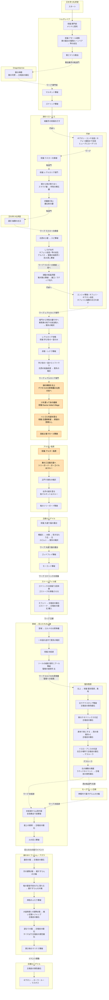

## 周回ルート図

```mermaid
flowchart TB
  classDef new fill:#ffe0b2,stroke:#e65100,color:#000
  classDef opt stroke-dasharray:5 5

  subgraph S0["王を待つ礼拝堂"]
    A0["スタート"]
  end

  subgraph S1["リムグレイブ"]
    A1["祝福 関門前<br/>メリナと契約"]
    A2["祝福 アギール湖南<br/>東の露台の擬態ルーンベア → 雫の幼生"]
    A3["第三マリカ教会"]
    A5["マルギット撃破"]
    A6["ゴドリック撃破"]
  end

  subgraph S1b["Dragonbarrow"]
    A4["獣の神殿<br/>獣の司祭 → 古竜岩の鍛石"]
  end

  subgraph RT["円卓"]
    R1["ギデオン・エンヤ会話 / ネフェリ最後まで会話<br/>ヒューグにローデリカ"]
    R2["エンシャ撃破 / ネフェリ・ギデオン会話<br/>ネフェリに嵐鷹の古王を渡す"]
  end

  subgraph S2["湖のリエーニエ"]
    L1["城裏手の祝福を灯す"]
    L2["祝福 ラスカーの廃墟"]
    L3["祝福 レアルカリア南門"]
    L4["塀から飛び降り北へ<br/>スマラグ裏 → 学院の輝石鍵"]
    L5["四鐘楼 頂上<br/>魔石剣の鍵"]
    L6["北西の小屋 → エビ撃破"]
    L7["しろがね村<br/>ネフェリ会話 / 雫の幼生<br/>アルバス → 聖樹の秘割符 / 忌み潰し撃破"]
    L8["湖脇の結晶洞窟<br/>猟犬騎士撃破 → 裏口 / ラティナ加入"]
    L9["南門から学院の鍵で中へ<br/>東南東の坂下の放浪商人 → 喪失の戦灰"]
    L10["レアルカリア攻略<br/>祝福 学び舎の一室のみ"]
    L11["赤狼・レナラ撃破"]
    L12["学び舎の一室からリフトで下<br/>北西の結晶段差 → 喪失の戦灰"]
    P0["湖の東側を北上<br/>デクタスの大昇降機の北西の谷へ"]
    P1["川を遡って谷の最奥<br/>祝福 Ravine-Veiled Village"]
    P2["ハシゴと坑道を登る<br/>祝福 古遺跡断崖 → 断崖の見晴らし"]
    P3["溶岩土竜マカール撃破"]
  end

  subgraph S0b["王を待つ礼拝堂"]
    C1["遺灰 嵐鷹の古王"]
  end

  subgraph S3["アルター高原"]
    T1["祝福 アルター高原"]
    T2["東の三叉路方面へ<br/>ツリーガード・ガーゴイルはスルー"]
    T3["正門で喪失の戦灰"]
    T4["右手の崖を登る<br/>偽マルギットはスルー"]
    T5["竜のツリーガード撃破"]
  end

  subgraph S4["王都ローデイル"]
    Y1["祝福 大通り脇の露台"]
    Y2["柵越え → 水路 → 突き当たり左 → 左<br/>ユビムシ → 喪失の戦灰"]
    Y3["ゴッドフレイ撃破"]
    Y4["モーゴット撃破"]
  end

  subgraph S5["ストームヴィル城"]
    V1["ゴドリックの祝福で2回休憩<br/>ゴストークを移動させる"]
    V2["ネフェリ → 古竜岩の鍛石<br/>ゴストーク → 古竜岩の鍛石 購入"]
  end

  subgraph S6["禁域 → 巨人たちの山嶺"]
    M0["禁域 → ロルドの大昇降機"]
    M1["一本道の途中で喪失の戦灰"]
    M2["祝福 氷結湖"]
    M3["ソールの城砦 宿将ニアール撃破<br/>聖樹の秘割符 左"]
    M4["氷結湖から山頂方面<br/>安息教会で翁撃破"]
    M5["崖上の骸骨 → 古竜岩の鍛石"]
    M6["火の巨人撃破"]
  end

  subgraph S7["聖別雪原"]
    N1["北上 → 祝福 聖別雪原、奥地"]
    N2["北でアナスタシア撃破<br/>古竜岩の喪色鍛石"]
    N3["東のテオドリックス付近<br/>古竜岩の鍛石"]
    N4["奥地で夜にする → 西の夜騎兵×2<br/>古竜岩の鍛石"]
    N5["イエロ・アニスの坑道<br/>白王の場所で古竜岩の鍛石 → デスルーラ"]
    N6["北の棄教の廃屋<br/>ラティナのイベント → 古竜岩の喪色鍛石"]
  end

  subgraph S7b["モーグウィン王朝"]
    G1["神殿内で墓すずらんの大輪"]
  end

  subgraph S8["崩れゆくファルム・アズラ"]
    F1["最初の龍 → 古竜岩の鍛石"]
    F2["次の建物2階 → 墓すずらんの大輪"]
    F3["竜の聖堂手前の穴に落ちる → 墓すずらんの大輪"]
    F4["神肌のふたり撃破"]
    F5["大曲剣使いの建物2階 → 細い足場へジャンプ<br/>古竜岩の鍛石"]
    F6["道なりの龍 → 古竜岩の鍛石<br/>すぐそばで古竜岩の喪色鍛石"]
    F7["黒き剣のマリケス撃破"]
  end

  subgraph S9["灰都ローデイル"]
    X1["古竜岩の喪色鍛石"]
    X2["ギデオン → ホーラ・ルー → ラスボス"]
  end

  A0 --> A1 --> A2 --> A3
  A3 -.->|"教会裏手の転送門"| A4
  A4 -.->|"ワープ 関門前"| A5 --> A6 --> L1
  L1 -.->|"円卓へ"| R1
  R1 -.->|"ワープ"| L2
  L2 -.->|"転送門"| L3 --> L4 --> L5
  L5 -.->|"転送門"| C1
  C1 -.->|"ワープ ラスカーの廃墟"| L6 --> L7
  L7 -.->|"ワープ ラスカーの廃墟 → 西へ"| L8
  L8 -.->|"円卓へ"| R2
  R2 -.->|"ワープ レアルカリア南門"| L9 --> L10 --> L11 --> L12
  L12 -.->|"ワープ レアルカリア南門"| P0 --> P1 --> P2 --> P3 --> T1
  T1 --> T2 --> T3 --> T4 --> T5 --> Y1
  Y1 --> Y2
  Y2 -.->|"ワープ 大通り脇の露台"| Y3 --> Y4
  Y4 -.->|"ワープ ゴドリックの祝福"| V1 --> V2
  V2 -.->|"ワープ 王都"| M0 --> M1 --> M2 --> M3
  M3 -.->|"ワープ ロルドの大昇降機<br/>聖樹への秘路"| N1
  N1 --> N2 --> N3 --> N4 --> N5
  N5 -.->|"デスルーラ"| N6
  N6 -.->|"西の転送門 任意"| G1
  N6 -.->|"ワープ 氷結湖"| M4
  G1 -.->|"ワープ 氷結湖"| M4
  M4 --> M5 --> M6
  M6 -.->|"巨人の火の釜でイベント"| F1
  F1 --> F2 --> F3 --> F4 --> F5 --> F6 --> F7
  F7 -.->|"イベント移動"| X1 --> X2

  class P0,P1,P2,P3,T1,T2 new
  class G1 opt
```
