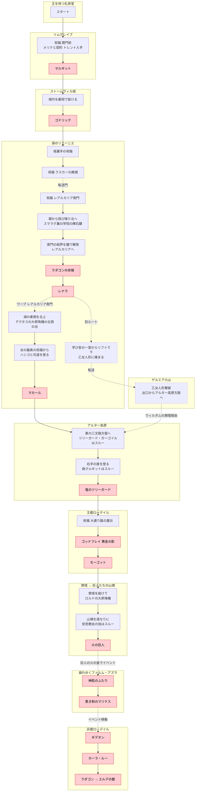

## 倒す必須ボス（13体）

| # | ボス | 場所 | 必須の理由 |
| - | - | - | - |
| 1 | マルギット | リムグレイブ | ストームヴィル城の門番 |
| 2 | ゴドリック | ストームヴィル城 | 大ルーン1つ目 |
| 3 | ラダゴンの赤狼 | レアルカリア | レナラへの道を塞いでる |
| 4 | レナラ | レアルカリア | 大ルーン2つ目 |
| 5 | マカール | 古遺跡断崖 | アルター高原への出口 |
| 6 | 竜のツリーガード | アルター高原 | 王都の門番 |
| 7 | ゴッドフレイ（黄金の影） | 王都 | モーゴットまでの道中 |
| 8 | モーゴット | 王都 | 禁域へ進むため |
| 9 | 火の巨人 | 巨人たちの山嶺 | 火の釜へ進むため |
| 10 | 神肌のふたり | ファルム・アズラ | 道中必須 |
| 11 | マリケス | ファルム・アズラ | 灰都へ進むため |
| 12 | ギデオン | 灰都 | ホーラ・ルーの手前 |
| 13 | ホーラ・ルー → ラダゴン/エルデの獣 | 灰都 | ラスボス |

## 最短ルート図

