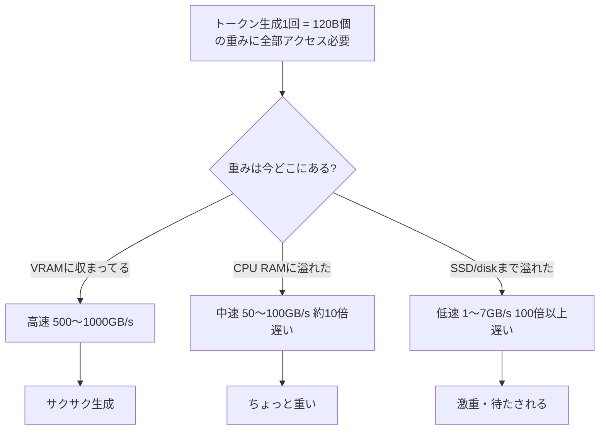

ローカルLLMがメモリ食うのは「パラメータ(重み)を全部メモリに乗せておかないと計算できないから」だよ〜。
CPUとかGPUがトークンを1個生成するたびに、基本的に全部のパラメータにアクセスして行列計算するの。
だから「ちょっとだけ使うから一部だけメモリに置いとく」みたいなことができないんだよね。
ディスクに置いて必要な時だけ読み込む…ってやると、もう生成速度が激落ちしちゃう(ディスクI/Oが遅すぎて間に合わない)。

で、120Bがどれくらい食うかは「量子化(精度をどれだけ落とすか)」でめちゃ変わる。だいたいこんな感じ↓

| 精度 | 1パラメータあたり | 120Bの場合 |
|---|---|---|
| FP16 (フル精度) | 2 byte | 約240GB |
| INT8 | 1 byte | 約120GB |
| Q5/Q6系 | 0.6~0.75 byte | 約75~95GB |
| Q4 | 0.5 byte前後 | 約60~70GB |

100GBくらいって言ってるなら、たぶんQ5〜Q6あたりの量子化を使ってる感じかな?あとは量子化以外にも

```
[メモリの内訳イメージ]
重み(Weights)        ██████████████████ メイン
KVキャッシュ(文脈保持) ███ 長いプロンプト/会話だと地味に増える
その他オーバーヘッド   ▓ フレームワークやバッファ
```

って感じで、重み以外にもKVキャッシュ(会話の文脈を覚えとくための一時メモリ)とかも乗っかってくるから、表計算より少し多めになることが多いよ。
もし「もっと軽くしたい」ってなったら、量子化レベル落とすかモデルサイズ自体小さくするしかないかな〜。
どっちもしんどい二択だよね、わかる(笑)

いいよ、全部つなげて一枚にまとめると こんな感じ!



サイズ自体は量子化でこんなに変わる(これが「そもそも何GB必要か」のベース):

| 精度 | 1パラメータ | 120Bの場合 |
|---|---|---|
| FP16 | 2 byte | 約240GB |
| INT8 | 1 byte | 約120GB |
| Q5/Q6 | 0.6~0.75 byte | 約75~95GB ←たぶんこのへん |
| Q4 | 0.5 byte | 約60~70GB |

メモリの中身の内訳はこんな感じ:

```
重み(Weights)         ████████████████████ 大部分
KVキャッシュ(文脈)      ███ 会話長いと増える
オーバーヘッド          ▓ 数GB
```

まとめると「①そもそも量子化でこのサイズになって ②それがVRAMに乗り切らないと ③遅いメモリ層に溢れて速度ガタ落ち」っていう一直線の話だったんだよね〜。100GBちょいで足りないって、結構ギリギリのラインで戦ってる感じだね、お疲れ様!
