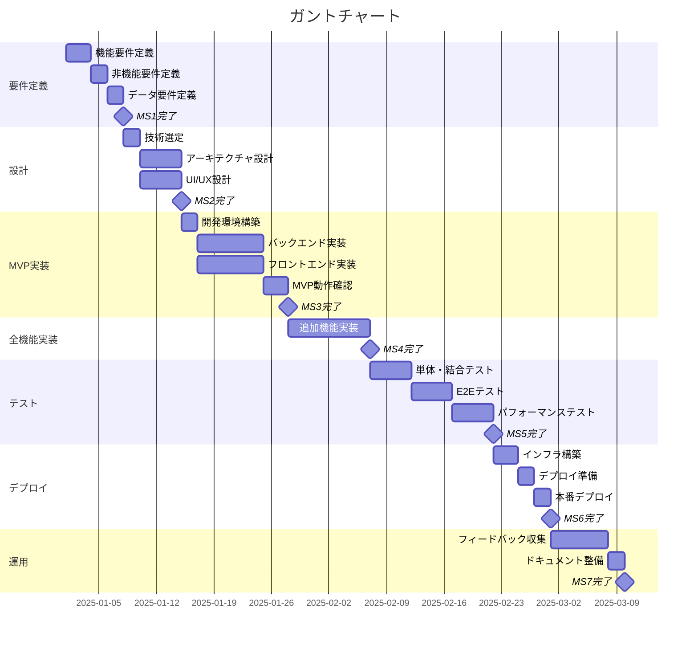

```mermaid
gantt
    title ガントチャート
    dateFormat YYYY-MM-DD

    section 要件定義
    機能要件定義 :req1, 2025-01-01, 3d
    非機能要件定義 :req2, after req1, 2d
    データ要件定義 :req3, after req2, 2d
    MS1完了 :milestone, m1, after req3, 0d

    section 設計
    技術選定 :des1, after m1, 2d
    アーキテクチャ設計 :des2, after des1, 5d
    UI/UX設計 :des3, after des1, 5d
    MS2完了 :milestone, m2, after des2, 0d

    section MVP実装
    開発環境構築 :dev1, after m2, 2d
    バックエンド実装 :dev2, after dev1, 8d
    フロントエンド実装 :dev3, after dev1, 8d
    MVP動作確認 :dev4, after dev2, 3d
    MS3完了 :milestone, m3, after dev4, 0d

    section 全機能実装
    追加機能実装 :full1, after m3, 10d
    MS4完了 :milestone, m4, after full1, 0d

    section テスト
    単体・結合テスト :test1, after m4, 5d
    E2Eテスト :test2, after test1, 5d
    パフォーマンステスト :test3, after test2, 5d
    MS5完了 :milestone, m5, after test3, 0d

    section デプロイ
    インフラ構築 :dep1, after m5, 3d
    デプロイ準備 :dep2, after dep1, 2d
    本番デプロイ :dep3, after dep2, 2d
    MS6完了 :milestone, m6, after dep3, 0d

    section 運用
    フィードバック収集 :ops1, after dep3, 7d
    ドキュメント整備 :ops2, after ops1, 2d
    MS7完了 :milestone, m7, after ops2, 0d
```
